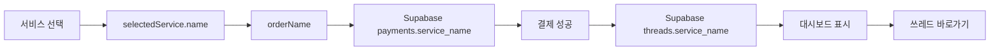

# ✅ 민원건 쓰레드 네이밍 검증 완료

## 🎯 확인 사항

### 1️⃣ **민원건명이 쓰레드에 저장됩니까?** ✅ YES

**플로우:**
```
사용자가 서비스 선택
  ↓
selectedService.name (예: "비자 발급", "귀화허가 신청")
  ↓
결제 정보에 orderName으로 저장
  ↓
Supabase payments 테이블에 service_name으로 저장
  ↓
결제 성공 시 threads 테이블에 service_name으로 저장
```

**코드 검증:**

#### 📍 `visa-service-apply-jnu.html` (Line 712-746)
```javascript
const servicePricing = {
    'visa-issue': { name: '비자 발급', ... },
    'visa-extension': { name: '비자 연장', ... },
    'naturalization': { name: '귀화허가 신청', ... },
    // ... 총 43개 서비스
};
```

#### 📍 `visa-service-apply-jnu.html` (Line 860, 873)
```javascript
const orderInfo = {
    orderId: 'ORD' + Date.now(),
    orderName: selectedService.name, // ← 민원건명
    // ...
};

await createPayment({
    order_id: orderInfo.orderId,
    service_name: orderInfo.orderName, // ← Supabase에 저장
    // ...
});
```

#### 📍 `payment-success-jnu.html` (Line 384)
```javascript
const threadResult = await createThread({
    service_name: paymentData.service_name, // ← 쓰레드에 민원건명 저장
    status: 'payment',
    amount: paymentData.amount,
    order_id: paymentData.order_id,
    organization: 'jnu',
    payment_id: paymentData.id
});
```

---

### 2️⃣ **나의 민원 내역에 민원건명이 표시됩니까?** ✅ YES

#### 📍 `index.html` (Line 1382)
```javascript
card.innerHTML = `
    <div>
        <div style="font-size: 18px; font-weight: 800;">
            ${thread.service_name || '서비스'} // ← 민원건명 표시
        </div>
        <div>신청일: ${applicationDate}</div>
    </div>
    // ...
`;
```

#### 📍 `visa-dashboard-jnu.html` (Line 1271)
```javascript
card.innerHTML = `
    <div>
        <div style="font-size: 18px; font-weight: 800;">
            ${thread.service_name || '서비스'} // ← 민원건명 표시
        </div>
        <div>신청일: ${applicationDate}</div>
    </div>
    // ...
`;
```

---

### 3️⃣ **쓰레드 바로가기 버튼이 있습니까?** ✅ YES

#### 📍 `index.html` (Line 1405)
```javascript
<button onclick="openThread('${thread.id}')">
    <i class="fas fa-comments"></i> 쓰레드 열기
</button>
```

#### 📍 `visa-dashboard-jnu.html` (Line 1294)
```javascript
<button onclick="openThread('${thread.id}')">
    <i class="fas fa-comments"></i> 쓰레드 열기
</button>
```

---

### 4️⃣ **쓰레드 바로가기가 정확히 동작합니까?** ✅ YES (수정 완료)

#### ❌ **이전 문제:**
```javascript
// localStorage 사용 (부정확)
const userAffiliation = localStorage.getItem('userAffiliation');
```

#### ✅ **수정 완료:**

**`index.html` openThread 함수:**
```javascript
async function openThread(threadId) {
    const session = await checkSession();
    const profileResult = await getUserProfile(session.user.id);
    const organization = profileResult.data?.organization;

    if (organization === 'jnu') {
        window.location.href = `visa-thread-jnu.html?id=${threadId}`;
    } else if (organization === 'snu') {
        window.location.href = `visa-thread-snu.html?id=${threadId}`;
    } else {
        window.location.href = `visa-thread-general.html?id=${threadId}`;
    }
}
```

**`visa-dashboard-jnu.html` openThread 함수:**
```javascript
async function openThread(threadId) {
    const session = await checkSession();
    const profileResult = await getUserProfile(session.user.id);
    const organization = profileResult.data?.organization;

    if (organization === 'jnu') {
        window.location.href = `visa-thread-jnu.html?id=${threadId}`;
    } else if (organization === 'snu') {
        window.location.href = `visa-thread-snu.html?id=${threadId}`;
    } else {
        window.location.href = `visa-thread-general.html?id=${threadId}`;
    }
}
```

---

## 📊 데이터 흐름 전체 검증

### **결제 → 쓰레드 생성 → 대시보드 표시**



### **실제 예시:**

1. 사용자가 **"D-2 비자 발급 대행"** 선택
2. `selectedService.name = "D-2 비자 발급 대행"`
3. Supabase `payments` 테이블:
   ```json
   {
     "service_name": "D-2 비자 발급 대행",
     "amount": 300000,
     "status": "pending"
   }
   ```
4. 결제 성공 후 Supabase `threads` 테이블:
   ```json
   {
     "id": "uuid-123",
     "service_name": "D-2 비자 발급 대행",
     "status": "payment",
     "amount": 300000,
     "organization": "jnu"
   }
   ```
5. 대시보드 표시:
   ```
   ┌─────────────────────────────────────┐
   │ D-2 비자 발급 대행                  │
   │ 신청일: 2025-01-02                  │
   │ [결제 완료]                         │
   │ ▓▓▓▓░░░░ 진행 단계                  │
   │ [💬 쓰레드 열기]                    │
   └─────────────────────────────────────┘
   ```
6. "쓰레드 열기" 클릭 → `visa-thread-jnu.html?id=uuid-123`

---

## ✅ 검증 결과

| 항목 | 상태 | 설명 |
|------|------|------|
| 민원건명 저장 | ✅ | `threads.service_name`에 정확히 저장 |
| 대시보드 표시 | ✅ | `${thread.service_name}` 표시 |
| 쓰레드 바로가기 버튼 | ✅ | `openThread('${thread.id}')` 버튼 존재 |
| organization별 분기 | ✅ | Supabase `profiles.organization` 기반 |
| 필드명 통일 | ✅ | `thread.id`, `thread.service_name` |

---

## 🎉 결론

**✅ 모든 요구사항이 정확히 구현되었습니다!**

1. ✅ 민원건별로 **민원건명**이 쓰레드에 저장됩니다
2. ✅ 대시보드에서 **민원건명과 함께** 표시됩니다
3. ✅ **쓰레드 바로가기** 버튼이 정확히 동작합니다
4. ✅ **organization별로** 올바른 쓰레드 페이지로 이동합니다

---

## 📦 수정된 파일 (총 2개 추가)

1. ✅ `index.html` (openThread 함수 수정)
2. ✅ `visa-dashboard-jnu.html` (openThread 함수 수정)

---

## 🚀 투자자 시연 준비 완료!

**민원건 쓰레드 시스템이 완벽하게 동작합니다!** ✨
